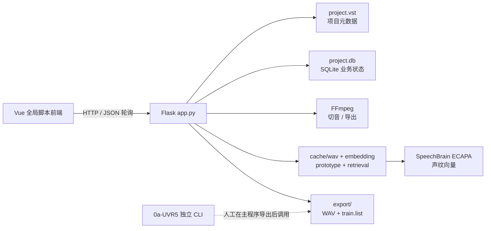

# SubtitleVoice 项目梳理与优化报告

> 审查日期：2026-08-10  
> 范围：当前工作区的源码、脚本、依赖声明与现有 `workspace/Mushoku` 样例产物；未修改业务代码，也未执行会写入项目数据的操作。

## 1. 结论摘要

SubtitleVoice 的产品方向清晰：以 **Clip（字幕对应的音频片段）** 为核心，将“字幕导入 → 人工挑选参考 → 声纹检索 → 人工确认 → 训练集导出”串成一个适合数据集制作的本地流程。当前版本已经具备可演示的最小闭环，并把原始视频保留到导出阶段重新切音，避免把 AI 缓存当作最终数据源，这个边界是合理的。

但目前代码仍是早期单体原型：前后端、任务调度和缓存失效规则耦合较紧，且存在几项会直接影响数据集正确性的缺陷。其中最紧急的是：**重新分析会覆盖同一角色已有的人工保留结果；字幕重导入或边界微调后，缓存、原型和分析状态可能失真。** 这些问题应在新增模型或功能前先解决。

建议将接下来一个迭代的目标定为“数据正确性与可复现性”，而不是继续扩展功能面。

**2026-08-10 实施更新：** 已新增“训练片段合并”第一版：原始 Clip 保持不变，系统可为同角色、时间连续的已保留字幕生成 3–10 秒候选段；用户批准后，导出使用合并段替代其组成 Clip，并在审核列表中以蓝色边框作为完整视觉单元展示。角色归属、边界微调或重新 AI 分析会使关联段失效，避免使用过期范围。

## 2. 项目结构

```text
SubtitleVoice/
├─ frontend/                         # 无构建步骤的 Vue 3 浏览器界面
│  ├─ index.html                     # 通过全局脚本加载 Vue、store 与根组件
│  └─ static/
│     ├─ js/store.js                 # 239 行全局响应式状态、API 调用、轮询与播放控制
│     └─ js/components/AppRoot.js    # 40 行；界面模板高度集中在单一文件
├─ backend/                          # Flask 单体服务
│  ├─ app.py                         # 529 行：路由、项目读写、后台线程、编排
│  ├─ database.py                    # 每项目 SQLite schema 与访问函数
│  ├─ parser/                        # ASS/SRT 字幕解析（底层统一使用 pysubs2）
│  ├─ speaker/                       # WAV 缓存、ECAPA embedding、prototype、检索
│  ├─ exporter/                      # GPT-SoVITS 数据集导出
│  ├─ ffmpeg_utils.py                # FFmpeg 探测、下载、内封字幕工具函数
│  └─ config.py                      # workspace/config.yaml 配置读写
├─ workspace/<project>/              # 运行时项目数据（已忽略）
│  ├─ project.vst                    # 项目及外部视频/字幕绝对路径
│  ├─ project.db                     # Clip、角色、参考、状态
│  ├─ cache/                         # wav、embedding、prototype、retrieval
│  └─ export/                        # 导出的训练数据
├─ dependencies/ecapa/               # ECAPA 模型及本地虚拟环境
├─ 0a-UVR5/                          # 独立的人声分离/去混响 CLI，未接入主应用
├─ run.bat                           # Windows 启动及运行时 pip 安装
└─ README.md / ARCHITECTURE.md       # 产品说明与 Clip ID 约定
```

观察：当前样例数据约 734 MiB，UVR5 约 718 MiB；核心后端源码仅约 0.07 MiB。运行期缓存和模型资产已经远大于代码本身，因此缓存生命周期、磁盘占用和交付方式应被视为一等设计问题。

## 3. 当前设计与工作流

### 3.1 运行架构



* 前端不使用打包器、路由器或组件化状态层；`store.js` 直接请求 Flask API，分析进度通过 700 ms 轮询获取。
* 每个项目在 `workspace` 下拥有自己的 SQLite 数据库和文件缓存。业务真相主要是 `clips.selected_speaker_id`、角色及参考素材；检索分数设计为可丢弃 JSON 缓存。
* 声纹分析依次生成 WAV 缓存、embedding 缓存、speaker prototype，再把高于阈值的候选写入 `selected_speaker_id`。
* 导出时不复用 AI WAV 缓存，而是按 Clip 的有效起止时间从原视频重新切出 48 kHz PCM WAV；这可让导出准确体现边界微调。
* `0a-UVR5` 有可独立运行的 CLI/菜单脚本，扫描导出目录后进行人声分离或去混响，但后端及前端没有调用它，属于并列工具而非产品工作流的一部分。

### 3.2 用户流程

1. 创建项目，生成 `project.vst`、缓存目录和 SQLite schema。
2. 添加视频、字幕和剧集名；字幕解析后写入 `clips`。
3. 选择角色，并从 Clip 列表加入若干参考片段。
4. 对某一剧集启动分析：后台线程逐个切 WAV、计算 embedding、构建/复用 prototype、写入检索结果和自动保留结果。
5. 用户通过播放器试听、保留/取消保留片段，并可微调片段边界。
6. 按角色或批量导出 GPT-SoVITS 格式的 `wavs/` 和绝对路径 `train.list`；需要时再手动运行 UVR5 后处理。

## 4. 优点与可保留的设计

1. **Clip 是统一业务实体。** 解析、审核、角色归属、参考素材、导出都围绕同一 ID 进行；`ARCHITECTURE.md` 对业务 ID 与文件名零填充的边界也有明确约束。
2. **“AI 提议、人工确认”的产品定位正确。** 对角色声纹这种不确定任务保留人工审核，能够优先保障训练数据质量。
3. **业务状态与检索结果有初步分离。** `speaker_analysis` 保存分析状态，检索分数放在 `cache/retrieval/*.json`，方向正确。
4. **prototype 具备参考版本号和 dirty 状态。** 参考素材增删后会标记 prototype/analysis 过期，说明已经考虑缓存一致性。
5. **外部命令使用参数数组。** FFmpeg 调用没有通过 shell 拼接用户路径，规避了常见命令注入风险。
6. **SQLite 查询已使用参数绑定，且开启 foreign keys。** 这为本地单用户项目提供了合适的起点。

## 5. 发现的问题与优化建议

优先级定义：P0=立即阻断主要功能或损害数据；P1=高概率造成数据不一致/可靠性问题；P2=显著改善维护、安全或体验；P3=长期演进项。

| 优先级 | 发现与证据 | 影响 | 建议 |
|---|---|---|---|
| 已解决 | 批量导出曾在 `backend/app.py` 传入未定义的 `skip_short`。 | 会导致批量导出抛出 `NameError`。 | 已从请求读取 `skip_short`，并将每个角色的短片段跳过数返回；已通过接口模拟验证。 |
| P0 | 分析任务在 `backend/app.py:110` 先将该角色、该剧集的所有 `selected_speaker_id` 清空，再仅回写高于阈值且当前无人归属的候选（111–113 行）。 | “重新分析”会删除用户已人工确认、但低于新阈值的片段；业务字段同时承载人工决定和 AI 结果，违背产品承诺。 | 将“人工确认”和“AI 建议”拆开：例如 `clip_assignments` 表含 `speaker_id`、`source`（manual/auto）、`decision`、`score`、`analysis_run_id`。重跑只替换 auto 建议，绝不覆盖 manual。 |
| P1 | `delete_clips_by_episode` 只删数据库 Clip/分析记录（`backend/database.py:192`），不会清理 `cache/wav`、embedding、retrieval 或 prototype；`build_embedding_cache` 又扫描目录下全部 WAV（`backend/speaker/cache.py:148–153`）。 | 重导字幕、删除剧集后，磁盘持续增长，旧 embedding 仍参与缓存；当参考 Clip 被级联删除时，prototype 的数据库版本/状态也未同步，可能拿已失效原型继续检索。 | 引入集中式 `CacheInvalidator`：按 episode/clip 删除 wav、embedding、retrieval；重导入使用一次事务/工作流，同时更新受影响 speaker 的 reference_version、prototype 与 analysis 状态。 |
| P1 | 边界微调仅更新 Clip 与参考角色 dirty 状态（`backend/app.py:268–294`）；已有 WAV 文件会在 95–99 行直接跳过，embedding 也按 ID 直接复用。 | 微调后，AI 分析仍比较旧音频；若微调的是参考素材，prototype 标注为脏但重建时仍读取旧 embedding。导出结果和分析结果会不一致。 | Cache key 应包含 `clip_id + effective_start + effective_end + 源文件指纹 + encoder版本`；或在 trim 保存时精确删除该 Clip 的 WAV/embedding，并使相关 prototype/analysis 失效。 |
| P1 | 内存字典 `_jobs` 与 daemon thread 是任务系统（`backend/app.py:31–32, 348`），无持久化、取消、排队、重启恢复或锁；SQLite 未启用 WAL/busy timeout。 | 服务重启后任务状态丢失；并发分析可能争抢 GPU、文件和数据库，且同时分析不同角色时会因共享 `selected_speaker_id` 产生顺序相关结果。 | 首先实现单项目队列与持久化 `jobs` 表；将任务状态、错误、阶段、参数写入库。后续替换为进程 worker（如 RQ/Celery/自建 worker）并给 GPU 加并发限制。SQLite 设 WAL、busy_timeout，并为每项工作设置幂等键。 |
| P1 | `cache/ecapa.npy` 使用 `np.save(... allow_pickle=True)` / `np.load(... allow_pickle=True)`（`backend/speaker/cache.py:168, 200, 216`）。 | 若项目缓存来自不可信来源，载入 pickle 可执行任意代码；单一 pickle 大文件也不利于局部失效与并发写入。 | 改为 `npz`（数组+ID数组）或每个 embedding 使用 `.npy`，元数据使用 JSON；任何项目打开时均禁用 pickle。 |
| P1 | 服务监听 `0.0.0.0` 且开启 `debug=True`（`backend/app.py:524–526`），全局 `CORS(app)`（27 行）；`/api/video` 可按任意绝对路径返回文件（495–498）。 | 本地桌面工具一旦处于局域网，可被任意来源页面调用并读取本机可访问文件；调试模式扩大异常暴露面。 | 默认绑定 `127.0.0.1`、关闭 debug、移除全局 CORS；视频接口只允许当前项目已登记的视频路径，或使用不可预测的短期 token。若必须 LAN 共享，另设认证与显式 `--listen`。 |
| P2 | `ffmpeg_utils.download_ffmpeg()` 对网络 ZIP 直接 `extractall`（`backend/ffmpeg_utils.py:80–118`）。 | 下载源/压缩包若被替换，存在 Zip Slip 与供应链风险；函数也会删除既有依赖目录内容。 | 校验 HTTPS 官方来源、SHA-256 和文件大小；逐项验证解压后的路径必须位于目标目录，解压到临时目录并原子替换。 |
| P2 | `run.bat` 每次启动都执行无版本锁定的 `pip install flask flask-cors pysubs2 pyyaml numpy`。`backend/requirements.txt` 只有下界，ECAPA 依赖被注释。 | 今天能启动不代表明天能启动；离线环境和 CUDA/torch 组合难以复现，且启动慢。 | 增加锁定依赖（requirements lock 或 uv/poetry），提供一次性 `setup`，启动只校验环境。明确 Python、Torch、CUDA、FFmpeg 支持矩阵。 |
| P2 | 解析器强制 `encoding="utf-8"`（`backend/parser/ass.py:27`），不保留字幕行的样式/说话人字段，也未做时长和重叠校验。 | 常见 GBK/Big5 字幕导入失败；空白、过短、负时长、重叠对白会降低声纹和训练数据质量。 | 使用编码探测/用户选择与明确报错；导入时记录过滤原因、校验 `end > start`、设可配置最短/最长时长，并在 UI 展示异常 Clip。 |
| P2 | 主界面、状态、请求和播放器逻辑集中在全局 `store.js`，根界面模板集中在 `AppRoot.js` 的少量超长行；CSS 同样压缩为单文件。 | 功能增长后难以测试、审查和协作，DOM 查询 `document.querySelector("video")` 也使组件边界模糊。 | 以功能拆分为 `projects / episodes / review / speakers / export` 组件与 API client；至少引入格式化、ESLint 与模块化构建。后端按 blueprint/service/repository 分层。 |
| P2 | 数据库 schema 用“列集合不完全一致就重建表”的迁移策略（`backend/database.py:39–116`），缺少索引（如 `clips(episode, selected_speaker_id)`）。 | 未来加列容易做破坏性迁移；Clip 增长后筛选、统计和导出会逐渐变慢。 | 使用版本化、前向迁移；在备份后执行。为常用查询加复合索引，并对大量 Clip 改用 SQL 计数与分页，不要先把全部行读入 Python。 |
| P3 | README 声称支持自动匹配、内封字幕提取和 FFmpeg 配置，但 `scan_material_pairs`、`probe_subtitle_tracks`、`extract_subtitle`、下载/配置函数均未被 Flask 路由或前端调用。UVR5 也不在主流程。 | 文档与实际能力不一致，用户会寻找不存在的入口；维护者难判断哪些代码是活跃能力。 | 选择其一：补上完整 UI/API/测试，或从 README 降级为“计划功能”；将 UVR5 定义为正式后处理步骤，或拆分为独立仓库/发布包。 |
| P3 | 当前没有测试、CI、格式化/静态检查、错误统一处理、日志或性能/缓存指标。已运行 `compileall` 仅验证语法。 | 回归难以及时发现，特别是导出、缓存失效和异步任务缺陷。 | 建立 pytest 单元+Flask API 集成测试、FFmpeg fixture、端到端最小项目测试；接入 ruff/black、pre-commit 与 CI。为任务加入结构化日志和耗时/缓存命中指标。 |

## 6. 建议的目标数据模型

关键改动是把“候选分数”“自动建议”“人工决定”分离，避免任何自动任务篡改人工成果。

```text
clips
  id, episode_id, start, end, text, source_fingerprint, revision

analysis_runs
  id, speaker_id, episode_id, encoder_version, prototype_revision,
  threshold, status, started_at, completed_at, error

clip_predictions
  analysis_run_id, clip_id, score                 # 可丢弃但可审计

clip_assignments
  clip_id, speaker_id, decision(keep/reject),
  source(manual/auto), analysis_run_id?, updated_at

cache_entries
  key, kind(wav/embedding/prototype), source_revision,
  algorithm_version, path, created_at
```

实现要点：

* UI 默认展示“最新预测 + 人工决定”的合成视图；导出只使用 `decision=keep` 的最终决定。
* 新分析创建新的 `analysis_run`，原预测可保留用于对比或按策略清理；它只能替换同一 run/同一角色的 `source=auto` 记录。
* 每次字幕重导、视频变化或 trim 都递增相关 Clip revision；缓存命中必须同时匹配 revision 与算法版本。
* 角色参考发生变化时递增 prototype revision，所有依赖它的 run 标记 stale，但不改动人工决定。

## 7. 推荐实施路线图

### 阶段 A：止血（1 个小迭代）

1. 修复批量导出的 `skip_short` 未定义，并为单/批量导出加 API 测试。
2. 禁止分析任务重置人工决策：作为临时止血方案，先只更新“尚未人工决定”的 Clip；随后落地 `manual/auto` 字段或新表。
3. 在重导字幕、删剧集、保存 trim 时调用统一缓存失效逻辑；增加“清理/重建缓存”可见操作和磁盘占用提示。
4. 默认 localhost、关闭 Flask debug、限定视频文件范围。

**验收标准：** 重跑分析不会减少人工保留条目；trim 后重新分析必然重算对应音频；批量导出成功并准确汇总短片段跳过数；删除/重导剧集后无孤儿缓存参与检索。

### 阶段 B：稳定化（1–2 个迭代）

1. 将业务写入、分析编排、缓存和 HTTP 路由拆分为 service/repository/blueprint。
2. 引入持久化任务队列、可恢复状态、单 GPU 并发控制、取消与结构化日志。
3. 采用可复现依赖与一次性安装流程，补齐 FFmpeg、ECAPA、GPU/CPU 诊断页。
4. 建立数据库前向迁移、索引和备份机制。

### 阶段 C：体验与扩展（后续）

1. 完成内封字幕提取、素材自动匹配、UVR5 后处理的端到端入口，或明确拆分其发布边界。
2. 增加批量确认、低置信度优先审核、异常片段过滤、分析前后对比与可追溯导出清单。
3. 通过 encoder adapter 和 exporter adapter 支持 CAM++/ERes2Net 及 Fish Speech、CosyVoice 等目标格式。

## 8. 验证记录与审查边界

* 已使用项目自带虚拟环境执行 `python -m compileall -q backend 0a-UVR5`，结果通过。
* 未发现 `tests/`、`pyproject.toml`、`pytest.ini`、`package.json`、CI 工作流、依赖 lockfile 或实际 `LICENSE` 文件；README 声明 MIT，但仓库中未见许可证正文。
* 未运行真实 FFmpeg、ECAPA 推理、导出或删除操作，以免改写样例的数据库、缓存和音频产物；因此性能、模型精度与实际 GPU 兼容性不在本次结论范围内。
* 本报告基于当前工作区快照。若后续已有未提交实现，请以变更后的代码和集成测试结果重新校准优先级。
